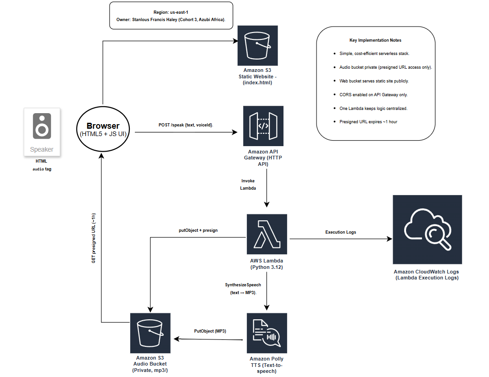

# Serverless Text-to-Speech on AWS

**Owner:** Stanlous Francis Haley (Cloud Engineering, Cohort 3 — Azubi Africa)  
**Region:** us-east-1

I built a serverless text-to-speech app that converts text to natural-sounding audio using a simple, cost-efficient AWS stack:

- **S3 static website** hosts `index.html`
- **API Gateway (HTTP API)** exposes `POST /speak`
- **AWS Lambda (Python 3.12)** orchestrates the flow
- **Amazon Polly** synthesizes speech (MP3)
- **Private S3 audio bucket** stores MP3s; the UI uses **pre-signed URLs (~1h)** for playback
- **CloudWatch Logs** capture Lambda execution

---

## Architecture

**Key notes**
- Web bucket is public read (static site).  
- Audio bucket is **private**; 1-day lifecycle expiry; SSE-S3 encryption.  
- CORS configured **only** on API Gateway (Allow: `*` origins, `POST, OPTIONS`, header `content-type`, max-age 3600).  
- Lambda env: `AUDIO_BUCKET`, `URL_TTL_SECONDS=3600`.  
- Lambda IAM: `polly:SynthesizeSpeech`, `s3:PutObject/GetObject` (scoped to the audio bucket), and `AWSLambdaBasicExecutionRole`.

---

## Deliverables (in this repo)

- **CloudFormation template:** [`infra/template.yaml`](infra/template.yaml)  
- **Architecture diagram:** [`architecture/diagram.png`](architecture/diagram.png)  
- **Lambda code:** [`lambda/lambda_function.py`](lambda/lambda_function.py)  
- **Project files (web UI):** [`web/index.html`](web/index.html)  
- **README:** (this file)  
- **Evidence & outcomes screenshots:** located in [`evidence/`](evidence/)

### Evidence (screenshots)
These images demonstrate the configuration and working outcome. (They’re also used in my slide deck.)

- S3 buckets list  
  

- S3 lifecycle rule for audio cleanup  
  

- API Gateway CORS configuration  
  

- Lambda → API Gateway trigger mapping  
  

- Lambda function overview  
  

- CloudWatch logs (Lambda execution)  
  

- IAM user & group (admin setup for this project)  
  

- Final working UI result (audio generated & playable)  
  

> If I add more evidence later, I’ll keep dropping files into `evidence/` and reference them here.

---

## How I deploy with CloudFormation (console)

1. Open **CloudFormation** → **Create stack** → *With new resources (standard)*.  
2. **Template source:** Upload `infra/template.yaml`.  
3. **Parameters:**  
   - **WebBucketName:** a **globally-unique** name (e.g., `tts-web-sfh-2025-09`)  
   - **AudioBucketName:** another unique name (e.g., `tts-audio-sfh-2025-09`)  
4. Create the stack (a few minutes).  
5. After it finishes, copy the **API Invoke URL** from **Outputs**.  
6. Upload `web/index.html` to the **web bucket**.  
7. In `index.html`, set `API_BASE` to the invoke URL (no trailing slash).  
8. Visit the **S3 static website endpoint** and test.

> I originally built the stack manually to learn each service. The template is included for repeatable deployments.

---

## Cost control

- Polly is billed per character; I test with short strings during development.  
- Audio bucket has a 1-day lifecycle **expire** rule.  
- I can delete the stack to remove all resources created by the template.

---

## Clean up

- If deployed via template: delete the **CloudFormation stack**.  
- If deployed manually: empty and delete both S3 buckets, remove the API, and delete the Lambda.
